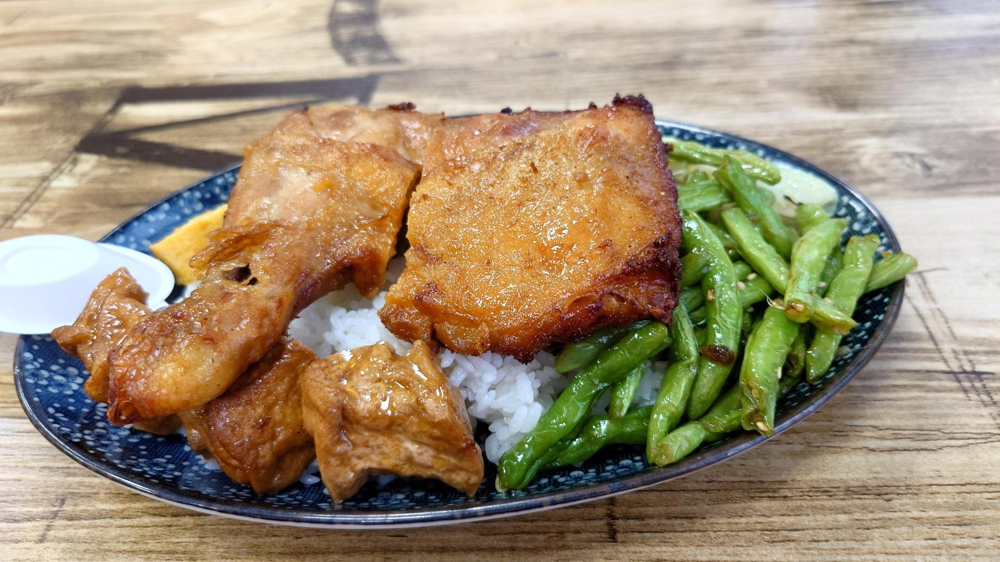
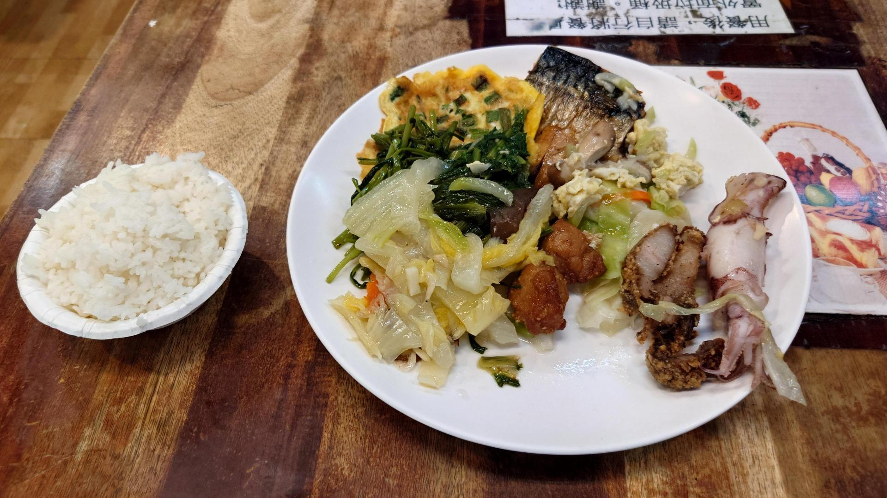
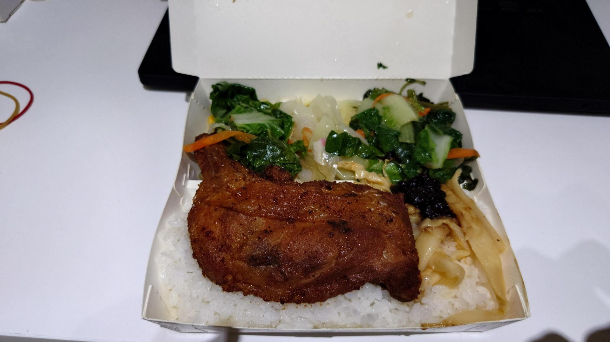
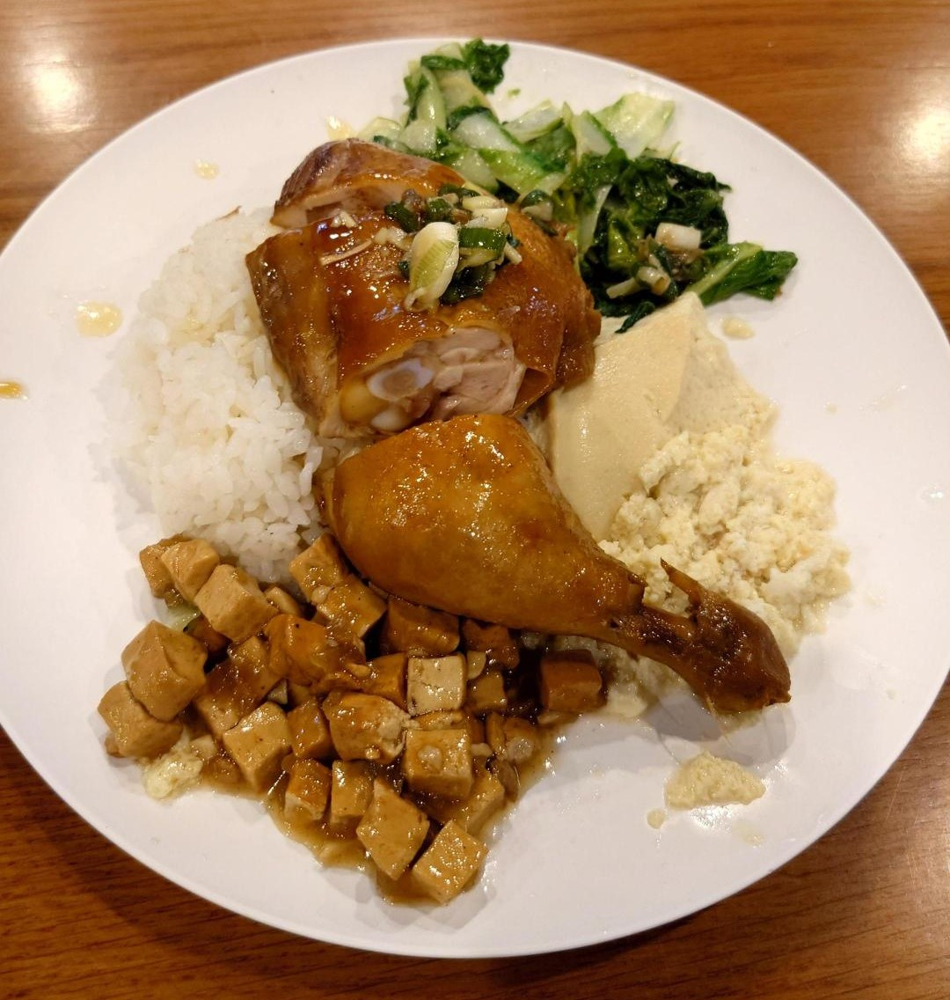
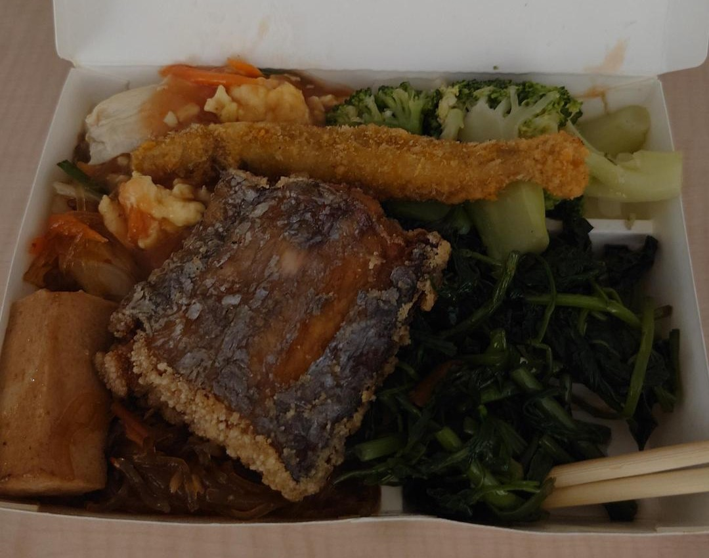

# Review of affordable restaurants in HsinChu, Taiwan.
因為這陣子兩個月來新竹生活所記錄的平價餐廳評鑑。希望有機會可以造福需要的人~
希望我可以努力持續更新!!

### 1. 麥大叔職人手做餐飲
地址: 香山區香北路160號1樓
短評: 環境乾淨整潔，生意偏冷清，有良好的用餐品質及環境。
廢話心得: 初來乍到新竹後除了7-11的第一份餐點，這間是簡餐店，有蠻多選項，普遍價格落在110~130左右。當時候抱著天龍人心態想說點了一個120元的雞腿飯，份量應該少少的這樣，沒想到送上來後發現我錯了，這個份量完全對得起甚至超過120元這個價格。可惜本人拍攝技術拙劣，沒有拍到隱藏在雞腿後面的蘿蔔蛋☹。

### 2. 珍品精緻自助餐
地址: 東區明湖路385號
短評: 環境偏老舊髒亂，菜色豐富度中，價格是由老闆娘的火眼金睛決定，綜合來說是中規中矩的自助餐店。
廢話心得: 招牌和店面有點老舊的關係，所以很不顯眼。我覺得通常經過的人應該是不會注意到這間自助餐店。吃完這間後真的完全沒什麼印象，是沒有到糟糕，但個人應該不會再去吃第二次就是了。

### 3. 嘉園自助餐
地址: 香山區北路108號
短評: 菜色多，cp值極高，缺點是要盡量6點30分前去買。
廢話心得: google地圖上說7點打烊，但其實大概6點45分老闆就在整理收拾了。但是夾了很多本來個人預估會算120竟然才90元。估價方式也是很隨意的看個兩眼決定。然後有免費的辣豆豉，配飯超級入味。

### 4. 交大天晟燒臘
短評: 普普通通，午餐趕時間隨便吃吃攝取熱量。

### 5. 交大自助餐
短評: 菜色非常豐富，且是好吃的，缺點是價格偏高。
廢話心得: 本以為學生餐廳的自助餐會便宜很多，結果夾如此份量竟然要150。而且是秤重計價，所以交大自助餐就是這麼貴QAQ。

### 6. 光榮自助餐
地址: 東區忠孝路19號
短評: 非常推薦，目前在新竹吃過菜色最多樣的自助餐，而且好吃。內用有白飯和湯吃到飽，但因為地段關係，價格偏貴。
廢話心得: 目前一個禮拜內唯一一間來訪兩次的自助餐店。選擇多樣，想吃清淡的清蒸肉和青菜，或是重口味的都有。也因為位處市區和清大之間，生意非常好。雖然價格是最貴的，以下這樣160元，但值得多次回訪。

### 7. 井町日式蔬食料理
地址: 北區大同路135號
短評: 非常有特色的創意素食料理，口味清淡且精緻，有多層次的風味。
廢話心得: 是新竹好麻吉兼素食王CIY大力推薦，非常適合我這種上了年紀不想吃太飽且有負擔的人XD。是個人目前在新竹這個禮拜第一份市區精緻餐點，也是這份評鑑裡面唯一非平價(以下青醬堅果蕎麥麵套餐320元)餐點。

### 8. 家蓁素食自助餐
地址: 香山區牛埔路106號
短評: 便宜到懷疑老闆有沒有在賺錢的素食自助餐，但菜色多樣性偏少，蛋白類食物也很少。
廢話心得: 只需要100元就可以吃到飽的素食自助餐，當下聽到完全傻眼，原來這年頭還有這種佛心公司，所以生意也蠻好的，看起來都是在地人熟客在吃。

